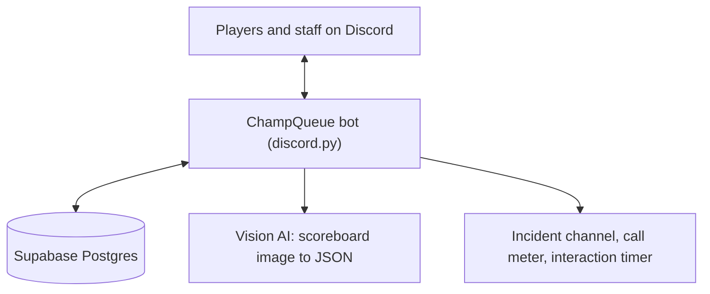

# 🏗️ Architecture

How Champion's Queue is put together: the moving parts, the match lifecycle, the rules engines and the reliability design.

> Written against the production code as of **2026-10-01**. For the player-facing flow see [PLAYER_GUIDE.md](PLAYER_GUIDE.md).

---

## 1. System overview

A single Python process connects to Discord, keeps all state in Postgres and calls a vision model once per match. Every database call goes through an **async proxy over a 50-thread pool**, so one slow query never freezes the event loop.

| Layer | Choice |
|---|---|
| Language / runtime | Python 3.10 |
| Discord | `discord.py` 2.7.1: slash commands, persistent buttons, a few text triggers |
| Database | Supabase (Postgres), accessed with `supabase` 2.31 over `httpx` |
| Scoreboard OCR | Vision LLM behind a provider interface (OpenAI in production; Anthropic and NVIDIA NIM adapters included) |
| Tests | pytest, with a fake database layer |

---

## 2. Code map

| Path | Role |
|---|---|
| `bot.py` | Entry point: installs the call meter and interaction timer, loads the cogs, sizes the thread pool, and keeps the bot in its home server only |
| `config.py`, `switches.py` | All constants and environment reads, including the queue registry and the feature switches |
| `cogs/registration.py` | `/register`, `/whoami` |
| `cogs/queue.py` | Queue panels, match formation, operator-skill vote, room code, `/afk`, `/report`, cleanup sweep |
| `cogs/match.py` | Result submission (`/match-submit` and `+result`), OCR handling, name resolution, AFK detection, review routing, approval, host tools |
| `cogs/stats.py` | Player and season stats, leaderboard, rank progress, achievements |
| `cogs/admin.py` | Staff tooling and the self-service IGN change |
| `cogs/points.py` | Season Points, shields, prize pool, points leaderboard, season checks |
| `cogs/digest.py` | Optional daily digest |
| `services/mmr_engine.py` | MMR rules and the rank ladder |
| `services/matchmaking.py` | Balanced team split, map pick |
| `services/vision_extraction.py` | OCR prompt and provider adapters |
| `database/db.py` | Database wrapper, async proxy and the retry helper |
| `database/*.sql` | Numbered SQL migrations (authoritative over `schema.sql`, which is the original baseline) |
| `utils/` | Embeds, permissions, incident log, call meter, interaction timer |
| `tests/` | 9 test files, 144 tests |

---

## 3. Match lifecycle

**Statuses:** `forming` → `awaiting_room` → `awaiting_result` → `pending_verification` → `completed`, with `awaiting_review` (needs staff) and `abandoned` as side states.

1. **Form.** At 10/10 the host presses *Start Match*. The bot reserves a match ID, balances the teams, picks one map, creates the private channel and posts the roster and operator-skill panels.
2. **Submit.** The host uploads one screenshot through `/match-submit` or `+result`. Both feed **one shared pipeline**. Only the host or an admin may submit, the file must be an image under 8 MB, and a second in-flight submission is blocked.
3. **Read.** The image goes to the vision model, which returns the ten rows as JSON. The raw output is stored with the match.
4. **Resolve names.** Each name is matched to the roster in four steps (exact, fuzzy, strip a truncation suffix then exact, strip then fuzzy). Ambiguous matches are refused, never guessed.
5. **Decide teams and winner** from the scoreboard's own grouping and score.
6. **Handle leavers.** The leaver count is ten minus the scoreboard rows. When unmatched players split cleanly into leavers and name typos, leavers get a zero-stat row and a losing result. Anything unclear goes to review.
7. **Write** the round data in one atomic database function, then validate: map matches, score readable, no tie, exactly one MVP per team, ten rows. Failures become a review issue.
8. **Verify.** The bot posts a verification card with both teams' stats and the proposed MMR and Season Points.
9. **Approve** by host click, by staff, or by a sweep after 300 seconds. One database function (`approve_match`) commits MMR, rank and Season Points **in a single transaction** and refuses unless the match is pending verification.
10. **Clean up.** The match channel is deleted 15 minutes later by a sweep stored in the database, so it survives restarts.

**Corrections.** `/correction-result` opens an issue that blocks approval while open. After approval nothing is reversed automatically; staff use the adjust commands, which write an audit row.

---

## 4. Rating rules

**MMR change** is a position table plus an MVP bonus:

| Position | 1 | 2 | 3 | 4 | 5 |
|---|---|---|---|---|---|
| Win | +9 | +8 | +6 | +4 | +3 |
| Loss | −3 | −4 | −6 | −8 | −9 |

The in-game MVP adds +5 (which can turn a loss positive, so a result is never inferred from the sign of a delta).

**No negative debt.** After each approved match the stored value becomes `max(0, current + this match's delta)`. Nothing below zero is ever carried. The same rule applies to Season Points.

**Ranks** are 200-point bands: Elite1 (0) · Elite2 (201) · PRO1 (401) · PRO2 (601) · Master1 (801) · Master2 (1001) · Grandmaster1 (1201) · Grandmaster2 (1401) · Legendary1 (1601) · Legendary2 (1801) · Titans (2001+). New players start at 200.

**Team balancing.** Teams are **random** unless all ten players have at least 10 completed matches and at least 20 approved players exist, because thin data should not be trusted. Otherwise the bot scores each player with a composite rating (`mmr + win_rate*100 + kd_ratio*40 + avg_hill_time*1.5 + mvp_rate*60`, where MMR is about 75% of the total) minus an uncertainty discount that shrinks as matches are played, then searches all 252 possible 5v5 splits. It picks at random among splits within a small tolerance of the best, so the same ten players do not always get identical teams, and which side is Defender or Attacker is a coin flip.

---

## 5. Season Points and shields

- One event per player per match, unique on season, player and match, so re-processing overwrites and never duplicates.
- **+5 per win, −3 per loss** by default, read from that match's own result (never from lifetime totals).
- **Shields** (one active at a time): *Normal* (72 h, +10 win, no loss penalty), *2x Normal* (144 h), *Premium* (72 h, +50 win during its first 24 h then +10). Credits purchases are event-sourced and atomic; paid grants need a second person's confirmation.
- **Prize pool** unlocks permanently when anyone reaches 2000 SP. The season locks only on its end date. At lock, ranks 1–3 are paid flat amounts if the pool unlocked, or `points ÷ 5` if it did not.
- **No scheduler.** Unlock and lock checks run lazily in the background after each match approval and each points-leaderboard reload.

---

## 6. Data model

Twenty tables, grouped by purpose:

| Group | Tables |
|---|---|
| Players | `players`, `ign_change_history`, `reputation_log`, `mmr_adjustment_log` |
| Queue and matches | `queue_entries`, `matches`, `match_players`, `match_round_results`, `match_player_stats`, `match_screenshots`, `match_issues`, `operator_skill_votes` |
| Season | `seasons`, `season_points`, `season_point_events`, `point_shields`, `sp_adjustment_log`, `hall_of_fame` |
| Progress | `achievements`, `player_achievements` |

Business-critical logic lives in SQL functions so it is atomic: `approve_match`, `update_season_points_for_match`, `replace_match_round_data` (atomic per-round write) and `recompute_player_career_stats_bulk` (one call for all ten players).

---

## 7. Reliability and observability

| Concern | Design |
|---|---|
| Slow or blocking I/O | All database calls are async through a 50-thread pool |
| Transient network faults | A retry helper (3 attempts, short backoff) for idempotent calls, limited to network-level errors |
| Restarts | Approval and cleanup run as database-backed sweeps (every 30 s and 5 min), not in-memory timers |
| Discord rate limits | Player-facing replies are wrapped so a 429 becomes a warning, never a crash; Join is disabled at 10/10; no-op replies are dropped; the skill vote answers with one call from an in-memory roster |
| Duplicate matches | The match ID is reserved up front and checked against the database |
| Bursts | One bulk SQL call replaces ten per-player stat recomputes |
| Incidents | A central incident channel with categorised posts; falls back to console if Discord is unavailable |
| Measurement | `DISCORD_METER`: one log line per active minute with Discord calls by type and outcome. `INTERACTION_TIMING`: one line per click or command with database, lock and Discord time |
| Guardrails | Per-user cooldowns on spammy actions; the bot leaves any server that is not its home server |

---

## 8. Design decisions

| Decision | Why |
|---|---|
| **The scoreboard is the source of truth** | Lobby sides often differ from the announced split, and the screenshot is what actually happened. |
| **Refuse rather than guess on names** | A wrong guess would give the wrong player the wrong rating. A person resolves ambiguity. |
| **One transaction for approval** | MMR, rank and points can never disagree with each other. |
| **One global pool, region as a label** | Short queues beat regional pools. Which queue a player can see is separate from who they are. |
| **No captains, no map vote** | Fewer steps before play; the host is the single accountable person. |
| **Lazy season checks** | No scheduler to run, monitor or restart. State heals on the next trigger. |
| **Feature switches** | Risky or optional behaviour (voice channels, upload paths, skill-vote storage) can be turned off without a deploy of new code. |
| **Measure before optimising** | The call meter and timer came before the performance work, so each fix had a before and after. |

---

## 9. Configuration

Configuration is entirely environment variables, read in `config.py`. See [`.env.example`](../.env.example) for every name with placeholders.

- **Required:** Discord token, server ID, admin role IDs, Supabase URL and service key.
- **Channels, roles and the vision provider:** listed in `.env.example`.
- **Feature switches:** voice channels, skill-vote storage, the two upload paths, interaction timing.
- **Limits:** the per-match sub-replacement cap.

Running or deploying this software requires the copyright holder's written consent (see [LICENSE.md](../LICENSE.md)).

---

## 10. Testing

`tests/` holds 9 files and 144 tests (pytest, with a fake database layer). They cover the skill vote's Discord call counts, the `+result` trigger, burst-reduction fixes, the bulk stats recompute, the call meter, the interaction timer, host commands, leaderboard defer behaviour and the status tracker. Win/loss derivation and the shield flow are the next areas on the list.
