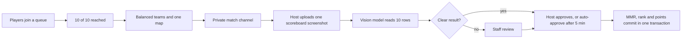

# 🏆 Champion's Queue

**Competitive 5v5 matchmaking for COD Mobile, run entirely inside Discord.**
Players queue up, the bot builds fair teams, reads the scoreboard screenshot with AI, and updates ranks and seasonal points. No spreadsheets, no manual score entry.

<!--
  SCREENSHOT SLOT (remove this comment once images are added):
  Put 3 images in docs/images/ and uncomment:
  

    
    
    
  

-->

---

## At a glance

| 🟢 Live since | 🎮 Format | 🧩 Slash commands | 🗄️ SQL migrations | 🧪 Automated tests | 💻 Python |
|:---:|:---:|:---:|:---:|:---:|:---:|
| **Jul 2026** | **5v5 Hardpoint, one round** | **38** | **40** | **144** | **~13K lines** |

---

## What it does

| | | |
|---|---|---|
| 🎯 **Fair matchmaking** Four queues feed one global pool. At 10 players the bot builds two teams, balanced on a rating that blends MMR with win rate, K/D and MVP rate once everyone has a track record (random before that), and picks one map that never repeats back-to-back. | 📸 **AI scoreboard reading** The host uploads one screenshot. A vision model reads all ten rows. Fuzzy name matching, leaver detection and a human review path handle anything unclear. | 📈 **MMR and ranks** Gains depend on position, result and MVP. An 11-tier ladder runs from Elite1 to Titans. Scores stop at zero, so a bad streak never leaves a hidden debt. |
| 🏅 **Season Points** Every match moves a seasonal score. Shields protect losses and boost wins. A prize pool unlocks once a player reaches 2000 points, and the season ends on a fixed date. | 🛡️ **Staff tools** Review queue, audit-logged point and MMR adjustments, report and AFK flows, and a two-person approval rule for paid shields. | ⚙️ **Built to stay up** Async database layer, retry on network faults, rate-limit-aware Discord calls, a per-minute call meter and per-click timing. |

---

## How a match works

The scoreboard is the source of truth: teams and winner come from the screenshot, not from how the lobby was announced. Anything ambiguous is sent to a person instead of guessed.

---

## Engineering highlights

- **Tamed a Discord rate-limit storm.** 193 rate-limit hits in four minutes at the worst point, down to zero across a later three-day window (3,205 Discord calls). The fixes were a one-call skill vote, batched match-start writes, dropped no-op replies and a bulk stats recompute that replaced ten per-player calls.
- **Measured before optimizing.** A per-minute Discord call meter and a per-click timing trace show where the time goes (database, lock or Discord), so each change was checked against numbers.
- **One transaction for everything that matters.** Approval commits MMR, rank and Season Points together in a single database function, with a status check that refuses a repeat.
- **Shipped a format change in a day.** The move from three-round to single-round matches landed as seven numbered steps in a single day, including a rewrite of the core result pipeline.
- **Real tests, not just demos.** 144 automated tests cover the skill vote, result upload, bulk stats recompute, call meter and interaction timer.

---

## Tech at a glance

| Layer | Choice |
|---|---|
| Bot | Python 3.10, `discord.py` 2.7, slash commands and persistent buttons |
| Data | Supabase (Postgres), 20 tables, SQL migrations, atomic approval function |
| Scoreboard OCR | Vision LLM behind a provider interface (OpenAI in production; Anthropic and NVIDIA NIM adapters included) |
| Reliability | Async database proxy over a 50-thread pool, retry layer, DB-backed sweeps that survive restarts |
| Observability | Incident channel in Discord, call meter, interaction timer |
| Testing | pytest, fake database layer |
| Hosting | Katabump |

---

## Journey

<b>Five milestones in three months</b> (full details in <a href="CHANGELOG.md">CHANGELOG.md</a>)

| When | Milestone |
|---|---|
| **Jul 2026** | First release: registration, queues, AI scoreboard reading, MMR engine, leaderboard. Live on 20 Jul. |
| **Late Jul** | Global pivot: East and West merged into one pool; rank ladder rebuilt. |
| **Aug** | One-round matches (RO1), AFK detection, balanced teams, achievements, incident channel. |
| **Sep** | Season 2: Season Points, shields, prize pool, Hall of Fame. Staff and host tools. |
| **Late Sep to Oct** | Performance push: rate-limit storms to near zero, India/ME-only queue, `+result` upload, 144 tests. |

---

## Documentation

| | |
|---|---|
| 🎮 [**Player guide**](docs/PLAYER_GUIDE.md) | How to register, queue, play and read your stats |
| 🏗️ [**Architecture**](docs/ARCHITECTURE.md) | Code map, match lifecycle, MMR and points rules, reliability design |
| 📜 [**Changelog**](CHANGELOG.md) | What changed and when |
| 🔐 [**Security**](SECURITY.md) | Trust boundaries and how to report an issue |

---

## Roadmap

- 🗓️ **Season 3**: planning starts once Season 2 closes on 10 October 2026
- ⚡ **Faster queue buttons**: fewer database round trips per Join and Leave
- ✅ **More tests**: win/loss derivation and the shield flow

---

## License and credits

© 2026 **Ashish Pandey**. All rights reserved.

This code is published for **demonstration and portfolio purposes**. Viewing the code and commit history here is welcome. Copying, modifying, distributing or deploying it requires written consent from the copyright holder (see [LICENSE.md](LICENSE.md)). To discuss using or building on it, get in touch through the GitHub profile.

Built for the COD Mobile community under the **Derive Esports** banner.
